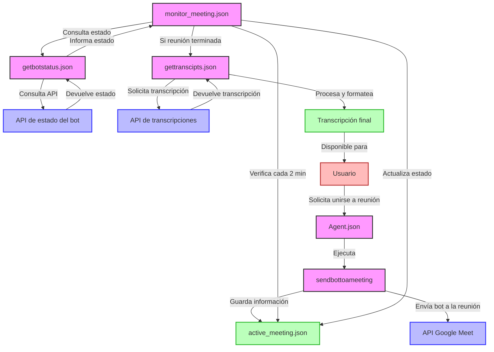

# Diagrama del Sistema de Monitoreo de Reuniones

## Leyenda

- 🟥 Usuario: Punto de entrada y salida del sistema
- 🟪 Flujos de trabajo: Componentes n8n que procesan la lógica
- 🟦 APIs: Servicios externos que proporcionan funcionalidades
- 🟩 Archivos: Almacenamiento de datos y resultados

## Descripción del Flujo

1. El usuario solicita al agente que envíe un bot a una reunión de Google Meet
2. El agente ejecuta el flujo `sendbottoameeting` que envía el bot a la reunión
3. El flujo `sendbottoameeting` guarda la información de la reunión en `active_meeting.json`
4. El flujo `monitor_meeting.json` se ejecuta periódicamente (cada 2 minutos)
5. `monitor_meeting.json` lee la información de la reunión activa y consulta su estado mediante `getbotstatus.json`
6. Si la reunión ha terminado, `monitor_meeting.json` ejecuta `gettranscipts.json` para obtener la transcripción
7. `gettranscipts.json` procesa y formatea la transcripción para que esté disponible para el usuario
8. `monitor_meeting.json` actualiza el estado de la reunión en `active_meeting.json`

Este sistema permite un monitoreo eficiente sin consumir tokens de IA innecesariamente, y automatiza la obtención de transcripciones cuando la reunión finaliza.
